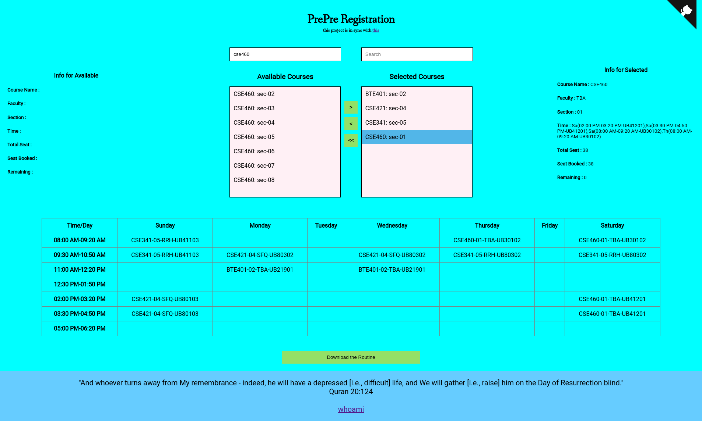

# PrePre Registration
---

An application that will give an opportunity to BracU students to prepare themselves before their pre-registration.

## How to run

Open any browser (chrome, firefox, brave etc) and press `ctrl+o` to open the `index.html`.

### Alternate way (serve the webpage)

Serve the webpage using a simple http server. For example,

#### Python (http.server)

```python
python3 -m http.server 8080
```

#### Nodejs (http-server)

```
npm install http-server
http-server
```
After serving visit with any browser using any of the socket address provided below.
```
https://localhost:8080
or 
https://<DEVICE IP ADDRESS>:8080
```


## ScreenShots




## Credit

Truly indebted to these open-source projects,

* ~~**tabletojson** : [https://www.npmjs.com/package/tabletojson](https://www.npmjs.com/package/tabletojson)~~
* **dual-listbox** : [https://github.com/maykinmedia/dual-listbox](https://github.com/maykinmedia/dual-listbox)
* **html2canvas** : [https://html2canvas.hertzen.com/](https://html2canvas.hertzen.com/) 
