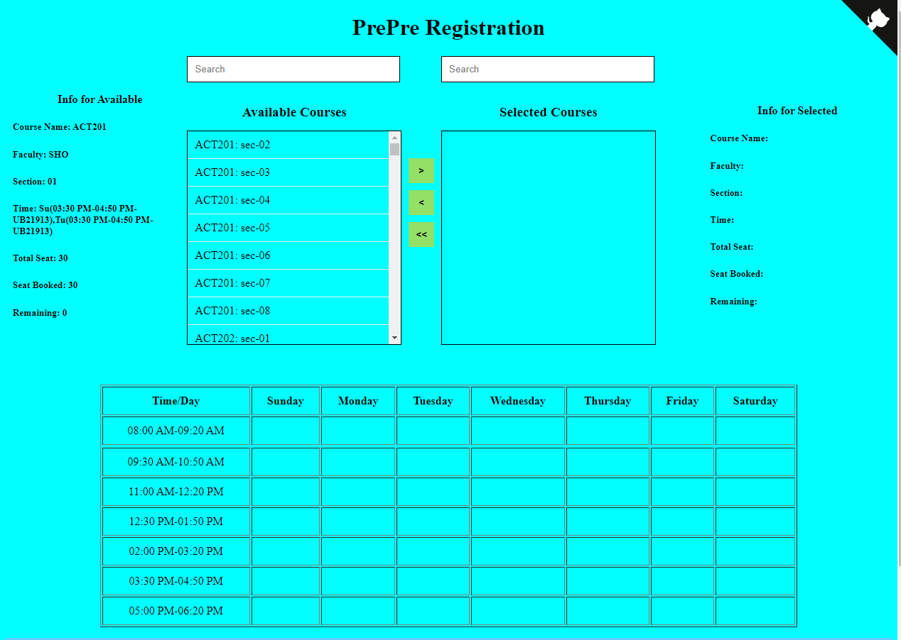

# PrePre Registration

An application that will give an opportunity to BracU students to prepare themselves before their pre-registration.


## How to

1. First of all, install nodejs in your computer.   
2. Open powershell or terminal in the project directory.
3. Use this command to install the dependencies.

```
npm install

```
4. After that run this to start the application.

```
npm run start

```
5. Visit https://localhost:8000 or https://[DEVICE IP ADDRESS]:8000

## ScreenShots



testing
